<div align="center">

# BalitaCare + 
### Sistem Manajemen Perkembangan Balita Terpadu

</div>

<div align="center">


[](https://flutter.dev)
[](https://dart.dev)
[](https://sqlite.org)
[](https://developer.android.com)
[](https://developer.apple.com/ios)

**Aplikasi mobile inovatif untuk monitoring dan tracking perkembangan balita dengan fitur analitik mendalam, laporan komprehensif, dan interface yang user-friendly.**

[📱 Download APK](https://github.com/Aldayanday1/balitacare/releases/download/v1.0.0/BalitacarePlus_v1_1.0.0.apk)  • [🤝 Kontribusi](https://github.com/Aldayanday1/balitacare/pulls) • [📧 Support](https://github.com/Aldayanday1/balitacare/issues)

---

### ✨ **Mengapa BalitaCare Plus?**

</div>

## 🎯 **Visi & Misi**

**Visi:** Menjadi solusi digital terdepan dalam pemantauan kesehatan dan perkembangan balita di Indonesia.

**Misi:** Memberikan tools yang mudah digunakan untuk orang tua dan tenaga kesehatan dalam memantau, menganalisis, dan melaporkan perkembangan balita secara akurat dan real-time.

---

## 🚀 **Fitur Unggulan**

### 📊 **Dashboard Analytics**
- **Real-time Statistics** - Lihat status kesehatan balita secara langsung
- **Interactive Charts** - Grafik pertumbuhan dengan visualisasi menarik
- **Status Monitoring** - Kategorisasi otomatis: Sehat, Gizi Kurang, Stunting
- **Trend Analysis** - Analisis perkembangan dari waktu ke waktu

### 👶 **Manajemen Data Balita**
- **Profil Lengkap** - NIK, nama, tanggal lahir, jenis kelamin, data orang tua
- **Data Kelahiran** - Berat badan lahir, tinggi badan lahir
- **Search & Filter** - Pencarian berdasarkan nama atau NIK
- **Data Validation** - Validasi otomatis untuk memastikan akurasi data

### 📈 **Tracking Perkembangan**
- **Multi-Parameter Measurement**:
  - 🏋️ Berat Badan
  - 📏 Tinggi Badan  
  - 🧠 Lingkar Kepala
  - 💪 Lingkar Lengan Atas
- **Flexible Measurement Methods** - Terlentang atau Berdiri
- **Historical Data** - Riwayat lengkap setiap pengukuran
- **Growth Curve Analysis** - Analisis kurva pertumbuhan WHO

### 📋 **Sistem Pelaporan Advanced**
- **Excel Export** - Export data ke format .xlsx
- **Custom Date Range** - Filter laporan berdasarkan periode
- **Detailed Reports** - Laporan komprehensif dengan analisis
- **Automated Notifications** - Notifikasi untuk reminder dan hasil export

### 🎨 **User Experience**
- **Intuitive Navigation** - Bottom navigation yang mudah digunakan
- **Smooth Animations** - Transisi halus dan engaging

---

## 🛠 **Teknologi & Arsitektur**

### **Frontend Framework**
```dart
Flutter 3.3.4+ // Cross-platform mobile development
Dart SDK >=3.3.4 <4.0.0 // Programming language
```

### **State Management & Architecture**
- **MVC Pattern** - Model-View-Controller untuk struktur yang clean
- **Controller Classes** - Separasi logic bisnis dari UI
- **Reactive Programming** - Real-time data updates

### **Database & Storage**
```sql
SQLite 2.3.3+ // Local database storage
```
- **Relational Database Design**
- **ACID Compliance** 
- **Optimized Queries**
- **Data Integrity**

### **Key Dependencies**
| Package | Version | Fungsi |
|---------|---------|--------|
| `fl_chart` | ^0.50.1 | Interactive charts & graphs |
| `excel` | ^2.0.4 | Excel file generation |
| `sqflite` | ^2.0.0+4 | SQLite database |
| `flutter_local_notifications` | ^12.0.4 | Push notifications |
| `intl` | ^0.18.0 | Internationalization |
| `quickalert` | ^1.1.0 | Beautiful alert dialogs |
| `syncfusion_flutter_charts` | ^20.4.54 | Advanced charting |

---

## 📱 **Screenshots & Demo**

<div align="center">

### 🏠 Dashboard Utama
*Real-time monitoring dengan visual analytics yang menarik*

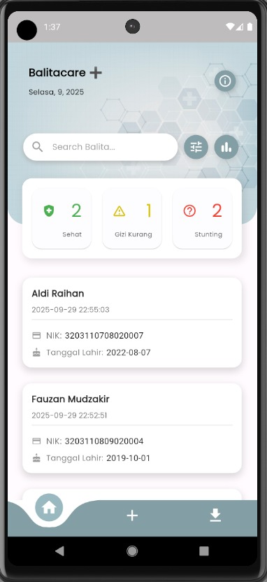
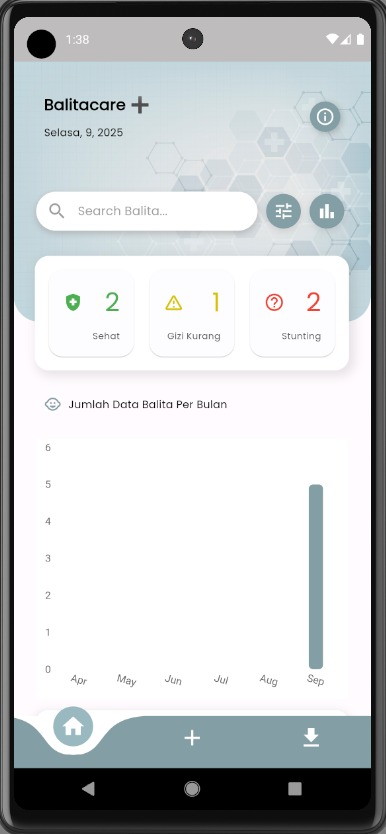

### 👶 Manajemen Balita  
*Interface yang clean untuk input data dan perkembangan balita*

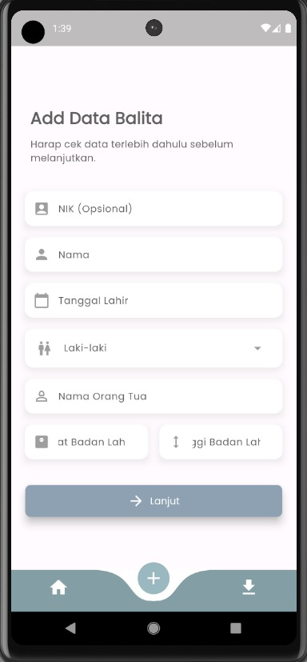
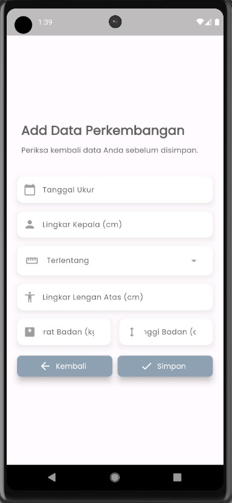

### 📊 Grafik Perkembangan
*Visualisasi detail growth chart yang interaktif dan informatif*

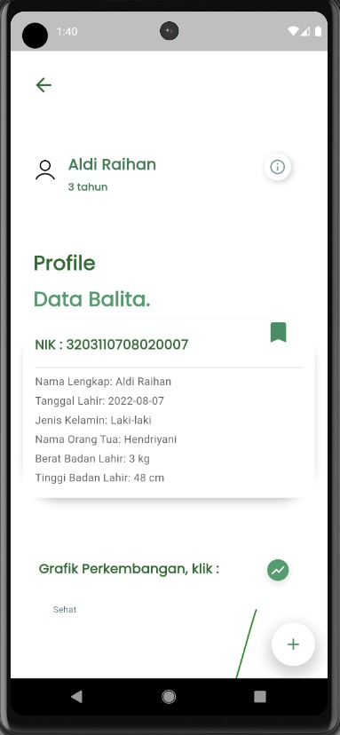
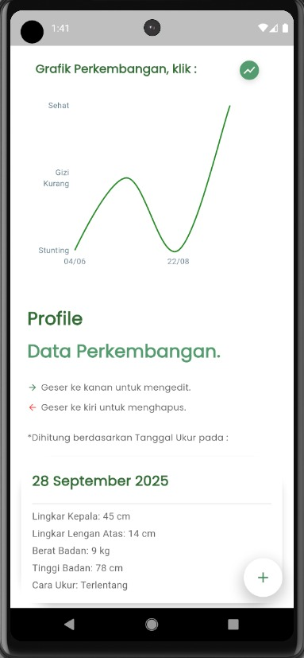

### 📋 Laporan Export
*Generate laporan Excel dengan satu tap*

<div align="center">
  <!-- Baris 1 -->
  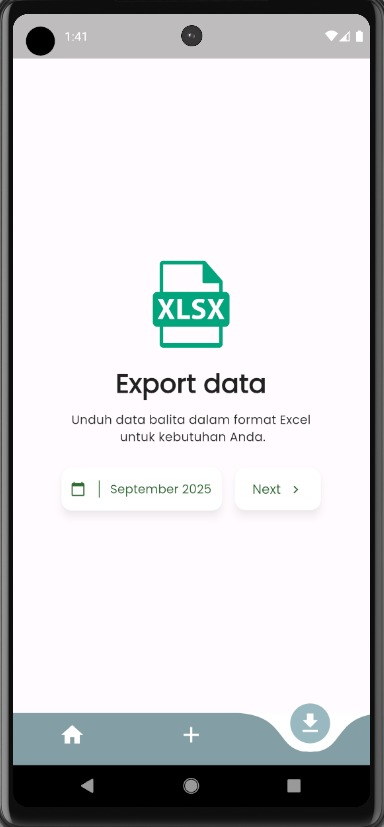
  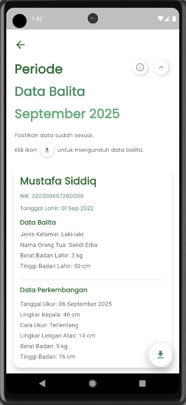
  <br/><br/>
  
  <!-- Baris 2 -->
  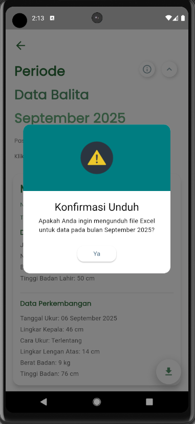
  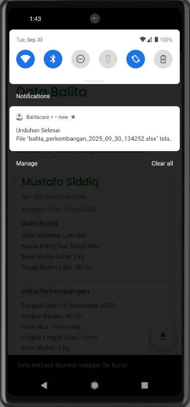
  <br/><br/>
  
  <!-- Baris 3 -->
  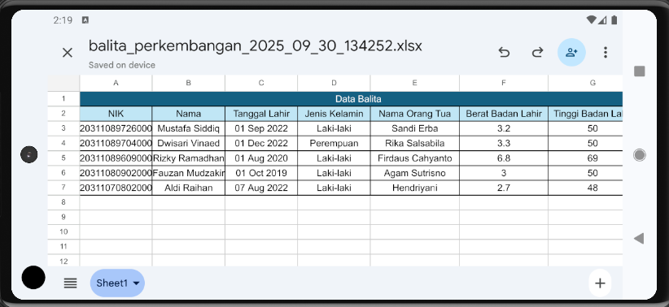
</div>


</div>

---

## 🚀 **Installation**

### **Prerequisites**
- Flutter SDK 3.3.4 atau lebih baru
- Dart SDK >=3.3.4 <4.0.0
- Android Studio / VS Code
- Android SDK (API level 21+)
- iOS 11.0+ (untuk iOS development)

### **Clone & Setup**
```bash
# Clone repository
git clone https://github.com/Aldayanday1/balitacare.git
cd balitacare

# Copy environment configuration
cp .env.example .env

# Install dependencies
flutter pub get

# Generate app icons
flutter pub run flutter_launcher_icons

# Run aplikasi
flutter run
```

### **⚠️ Important: Data Privacy**
Repository ini **TIDAK** menyertakan data sensitif seperti:
- ❌ Database dengan data real pasien
- ❌ File export Excel
- ❌ API keys atau credentials
- ❌ Personal information

Database akan otomatis dibuat saat pertama kali aplikasi dijalankan. Lihat [SECURITY.md](SECURITY.md) untuk detail lengkap.

### **Build untuk Production**
```bash
# Android APK
flutter build apk --release

# Android App Bundle
flutter build appbundle --release

# iOS
flutter build ios --release
```

---

## 🏗 **Arsitektur Proyek**

```
lib/
├── 📁 controllers/           # Business logic & data management
│   ├── balita_controller.dart
│   └── perkembangan_controller.dart
├── 📁 database/             # Database operations
│   └── database_helper.dart
├── 📁 models/               # Data models
│   ├── balita.dart
│   ├── perkembangan.dart
│   └── bar_chart_data.dart
├── 📁 views/                # UI Components
│   ├── 📁 balita_screen/    # Balita related screens
│   ├── 📁 perkembangan_screen/ # Development tracking screens
│   └── 📁 splash_pages/     # Splash & onboarding
└── main.dart                # Application entry point
```

### **Database Schema**
```sql
-- Tabel Balita
CREATE TABLE Balita (
  id INTEGER PRIMARY KEY AUTOINCREMENT,
  nik TEXT,
  nama TEXT NOT NULL,
  tanggalLahir TEXT NOT NULL,
  jenisKelamin TEXT NOT NULL,
  namaOrangTua TEXT NOT NULL,
  beratBadanLahir REAL NOT NULL,
  tinggiBadanLahir REAL NOT NULL,
  createdAt TEXT DEFAULT CURRENT_TIMESTAMP
);

-- Tabel Perkembangan
CREATE TABLE Perkembangan (
  id INTEGER PRIMARY KEY AUTOINCREMENT,
  balitaId INTEGER NOT NULL,
  tanggalUkur TEXT NOT NULL,
  beratBadan REAL NOT NULL,
  tinggiBadan REAL NOT NULL,
  lingkarKepala REAL NOT NULL,
  lingkarLenganAtas REAL NOT NULL,
  caraUkur TEXT NOT NULL,
  createdAt TEXT DEFAULT CURRENT_TIMESTAMP,
  FOREIGN KEY (balitaId) REFERENCES Balita (id) ON DELETE CASCADE
);
```

---

## 🎯 **Use Cases**

### **👨‍⚕️ Untuk Tenaga Kesehatan**
- Monitoring kesehatan balita dalam jumlah besar
- Generate laporan untuk puskesmas/posyandu
- Identifikasi dini masalah pertumbuhan
- Export data untuk analisis lebih lanjut

### **👨‍👩‍👧‍👦 Untuk Orang Tua**
- Track perkembangan anak sendiri
- Memahami status kesehatan anak
- Riwayat lengkap pertumbuhan
- Reminder untuk kontrol rutin

### **🏢 Untuk Institusi Kesehatan**
- Database terpusat data balita
- Laporan statistik wilayah
- Program intervensi gizi
- Research & analytics

---

## 🔧 **API Documentation**

### **BalitaController Methods**
```dart
// CRUD Operations
Future<int> addBalita(Balita balita)
Future<List<Balita>> getAllBalita()
Future<Balita?> getBalitaById(int id)
Future<void> updateBalita(Balita balita)
Future<void> deleteBalita(int id)

// Analytics & Filtering
Future<Map<String, int>> getStatusCounts()
Future<List<Balita>> getBalitaByStatus(String status)
Future<List<Balita>> getBalitaByGender(String gender)
Future<List<Balita>> searchBalita(String query)
```

### **PerkembanganController Methods**
```dart
// Growth Tracking
Future<int> addPerkembangan(Perkembangan perkembangan)
Future<List<Perkembangan>> getPerkembanganByBalitaId(int balitaId)
String determineStatus(String gender, double weight, double height)

// Analytics
Future<List<Map<String, dynamic>>> getGrowthChartData(int balitaId)
```

---

## 🤝 **Contributing**

Kami sangat welcome kontribusi dari developer community! 

### **Cara Berkontribusi:**

1. **Fork** repository ini
2. **Create** feature branch (`git checkout -b feature/AmazingFeature`)
3. **Commit** perubahan (`git commit -m 'Add some AmazingFeature'`)
4. **Push** ke branch (`git push origin feature/AmazingFeature`)
5. **Open** Pull Request

### **Contribution Guidelines:**
- ✅ Ikuti Flutter/Dart coding standards
- ✅ Tambahkan unit tests untuk fitur baru
- ✅ Update dokumentasi jika diperlukan
- ✅ Pastikan build berhasil sebelum PR

### **Bug Reports & Feature Requests:**
Laporkan bug atau ajukan usulan fitur melalui GitHub Issues.

---

## 📊 **Statistics & Analytics**

<div align="center">

### **📈 Project Stats**


### **💻 Tech Stack**


### **🔧 Development**


</div>

---

## 👥 **Team & Credits**

<div align="center">

### **🏆 Core Team**

**[Aldayanday1](https://github.com/Aldayanday1)**  
*Lead Developer & Project Architect*  
💼 Full-stack Developer  
🎯 Focus: Core architecture, database design, UI/UX

### **🙏 Acknowledgments**

Terima kasih kepada:
- **Flutter Team** - Framework yang luar biasa
- **Syncfusion** - Advanced charting components  
- **SQLite Team** - Robust database engine
- **Open Source Community** - Inspiring packages & tools
- **Canva** - Media desain  
- **Ikon & Gambar** - Dari berbagai sumber (beberapa mungkin terlupa)

</div>

---

## 📞 **Support & Contact**

<div align="center">

### **🆘 Need Help?**

📧 **Email:** onlymarfa69@gmail.com
💬 **Telegram:** [@aldayanday1](https://t.me/aldayanday1)  
💡 **Bug Reports & Feature Requests:** [GitHub Issues](https://github.com/Aldayanday1/balitacare/issues)  

### **🌟 Show Your Support**

Jika proyek ini membantu Anda, jangan lupa:
- ⭐ **Star** repository ini
- 🍴 **Fork** untuk kontribusi
- 📢 **Share** ke teman-teman
- 💖 **Sponsor** development

[](https://github.com/Aldayanday1/balitacare/stargazers)
[](https://github.com/Aldayanday1/balitacare/network)

---

### **🚀 "Kesehatan balita adalah investasi masa depan bangsa"**

**Made with ❤️ in Indonesia**

</div>

---

## 📋 **Changelog**

### **v1.0.0 (Current)**
- ✅ Core CRUD operations untuk data balita
- ✅ Sistema tracking perkembangan komprehensif  
- ✅ Dashboard analytics dengan visualisasi charts
- ✅ Excel export functionality
- ✅ Local notifications system
- ✅ SQLite database dengan relational schema
- ✅ Search & filter capabilities
- -
- ✅ Basic UI framework
- ✅ Database schema design
- ✅ CRUD operations prototype
- -
- ✅ Project initialization
- ✅ Basic Flutter setup
- ✅ Initial UI mockups


---

<div align="center">

**⚡ Built with passion, powered by Flutter ⚡**

*Mulailah perjalanan Anda bersama BalitaCare + untuk menjaga tumbuh kembang si kecil dengan lebih terarah!*

</div>
